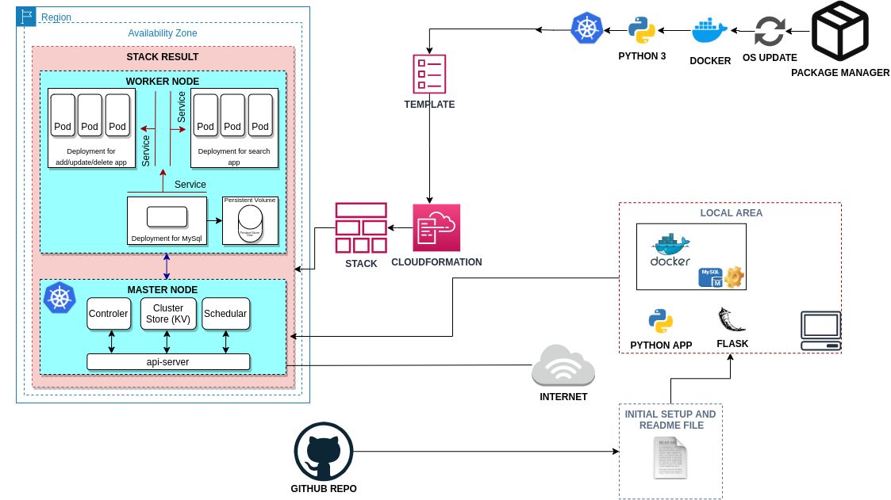

# Microservice-Phonebook Web Application (Python Flask) with MySQL using Kubernetes.

## Description

Phonebook Microservice Web Application aims to create a web application with MySQL Database using Docker and Kubernetes to understanding of Microservice architecture. In this application, we have a frontend service and a backend service to interact with database service. Each service managing by a Kubernetes deployment. The backend service is a gateway for the application and it servings the necessary web pages for create, delete, update operations while the frontend service serving a search page in order to conduct read operations. To preserve the data in the database, persistent volume and persistent volume claim concepts adopting.

